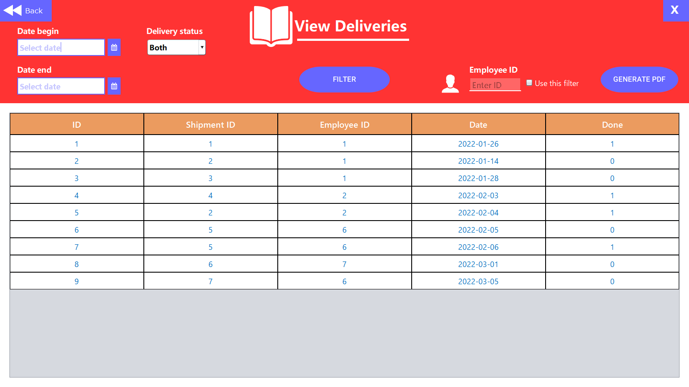
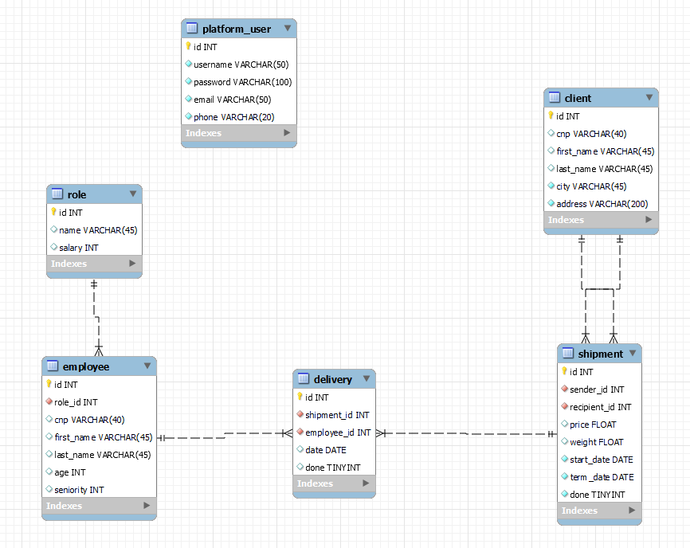

# Wing Delivery
## What it is
This is a delivery firm management system with a GUI that was built in Java using Swing. Wing Delivery is a placeholder name for the company.

The project is designed to handle a MySQL database. The software is intended to assist the employees, not to be used by clients. This implementation has some simplifications and fits a C2C (client to client) business model.

## Technologies used
- Java
- MySQL
- NetBeans IDE

## Features
- Login and Signup using accounts stored in database to access features.
- Home window to view and access all features.
- CRUD operations for all database objects (except platform_users) using dedicated windows for each.
- Dedicated window for issuing shipments.
- Window for viewing and filtering shipments and deliveries by a few criterias.
- After filtering, PDFs containing the data can be generated.
- Input validation for some fields.
- Data displayed remains in sync with the database during all operations.
- Sample DB with dummy data provided

## Screenshots
- Signup window

- Home window

- Manage shipments window

- Issue shipments window

- Filter deliveries window

- Database structure

